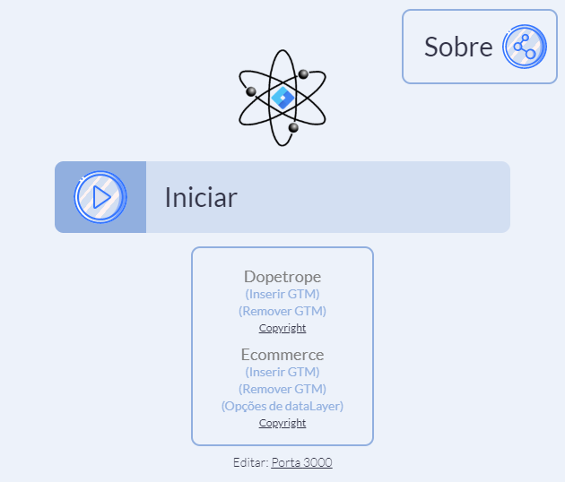

# GTM Tester

## Objetivo
A aplicação GTM Tester foi criada com o objetivo de disponibilizar um ambiente próprio com templates de websites para inserção de tags do GTM.


## Build da aplicação

Para efetuar o build da aplicação, é necessária a instalação do **electron-packager**. Tendo o electron-packager instalado, basta utilziar o comando:

```
npm run package-win
```


## Iniciando a aplicação

Para iniciar a aplicação, é necessário iniciar o arquivo executável gerado no build da aplicação.

A tela inicial será aberta, nela podemos clicar no botão "Iniciar" para iniciar a aplicação, inserir e remover o GTM dos sites e clicar no nome dos sites para abrir em seu navegador padrão.




## Copyright e Créditos
- O site [Dopetrope](https://html5up.net/dopetrope) foi disponibilizado pela [HTML5 UP](https://html5up.net/).
- O site de [e-commerce](https://github.com/chekromul/uikit-ecommerce-template) foi disponibilizado via Github pelo usuário [chekromul](https://github.com/chekromul) - MIT License.